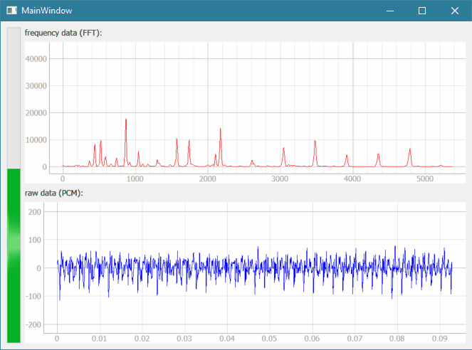

# audioMonitorQt

qt audio monitor based on https://github.com/swharden/Python-GUI-examples/tree/master/2016-07-37_qt_audio_monitor

the "main" code: [go.py](https://github.com/hchiam/audioMonitorQt/blob/master/go.py) -> depends on: ui_main.py, SWHear.py, and pyqtgraph, ...

# how to install PyQtGraph (the code depends on it)

Go to http://www.pyqtgraph.org/ and look for instructions around "Everybody (including OSX)": you need to run "python setup.py install" from within the extracted directory.

# how to run all this the code:

In Terminal or CommandLine, enter:
python go.py

# qt audio monitor

PROJECT PAGE: http://www.swharden.com/wp/2016-07-31-real-time-audio-monitor-with-pyqt/

This is a minimal-case example how to get continuous PCM data from the sound card. A preliminary SWHEar class is included which can self-detect likely input devices. To manually define an input device, set it when SWHEar() is called. In most cases it will work right out of the box. If you're playing music and no microphone is detected, it will use the sound mapper and graph the audio being played.

Youtube demo: https://youtu.be/lDS9rI0o6mM

# audioMonitorQt

qt audio monitor based on https://github.com/swharden/Python-GUI-examples/tree/master/2016-07-37_qt_audio_monitor